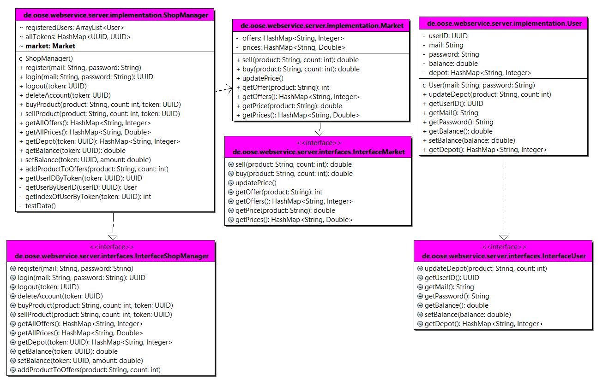

Autoren: Timon Stronczek, Justus Pfaue, Bonnie Jo Mayer

## Frameworks:
- com.sparkjava:spark-core:2.9.3 (REST-Endpoints)
- com.google.code.gson:gson:2.7 (JSON-Handling)

## Bibliotheken: 
- UUID
- util.*
- management.*
- ...

## Rest-API

- /user/register - register a user with a post request {"mail":"MAIL","password":"PASSWORD"}
- /user/login - login with a post request {"mail":"MAIL","password":"PASSWORD"}
- /user/logout - logout with a delete request {"token": "TOKEN"}
- /user/removeUser - remove a user with a delete request {"token": "TOKEN"}
- /user/addMoney - addMoney to the user with a post reqeuest {"token": "TOKEN","value":"VALUE"}
- /user/balance - get the current balance with a post reqeuest {"token": "TOKEN"}
- /user/depot - get the items in the depot with a post reqeuest {"token": "TOKEN"}
- /market/products - get the items in the market with a post reqeuest {"token": "TOKEN"}
- /market/addProductToMarket - add a product to the market with a post reqeuest {"token": "TOKEN","productname":"PRODUCTNAME","count":42}
- /market/sell - sell a product to the market with a post reqeuest {"token": "TOKEN","productname":"PRODUCTNAME","count":42}
- /market/buy - buy a product to the market with a post reqeuest {"token": "TOKEN","productname":"PRODUCTNAME","count":42}

